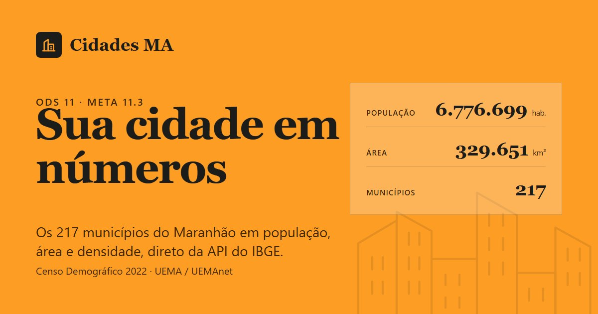
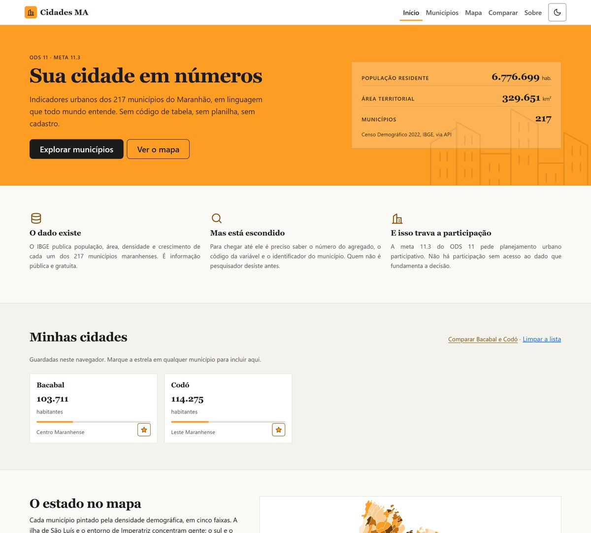
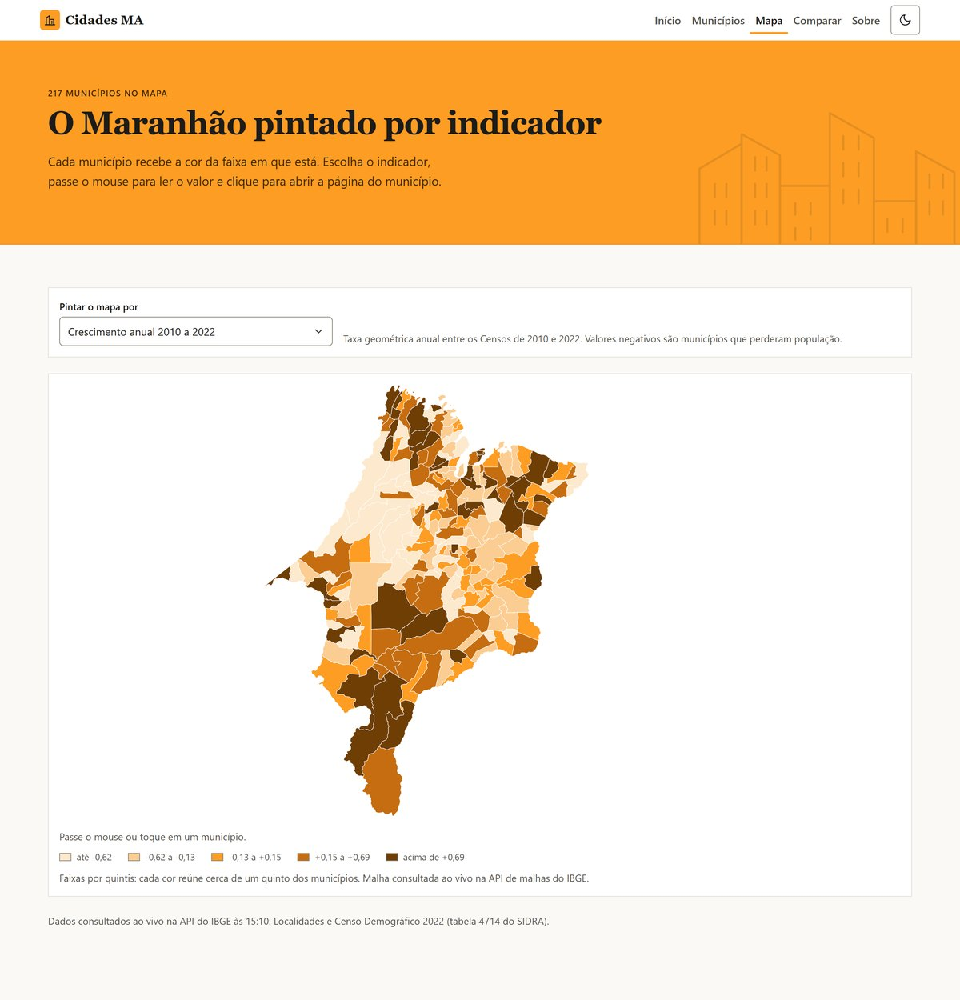
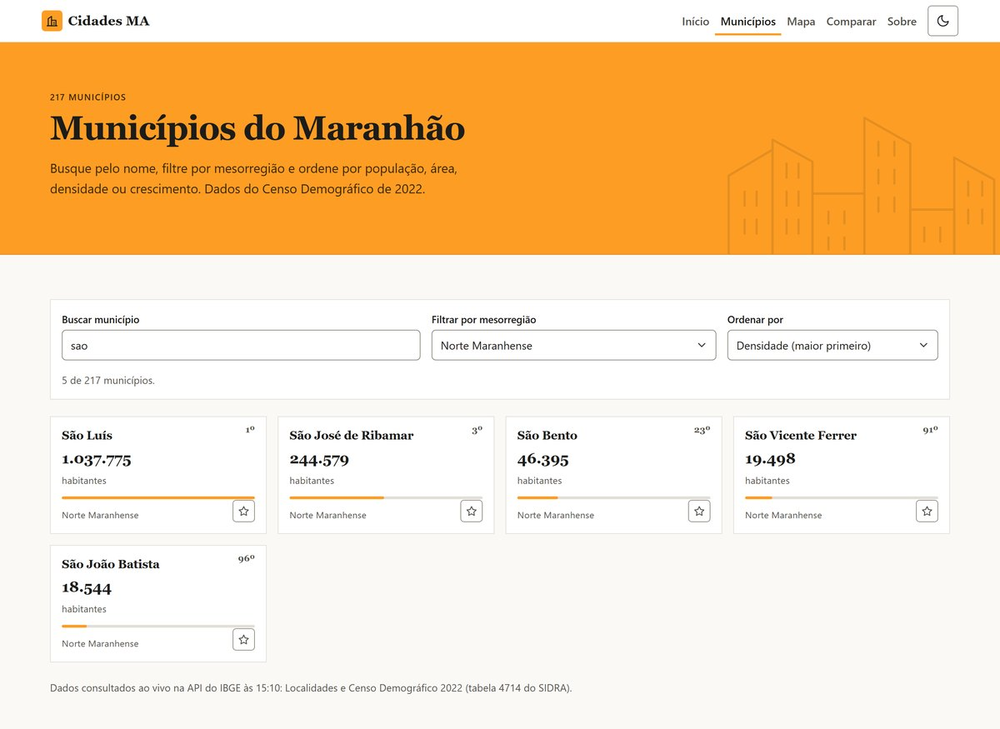
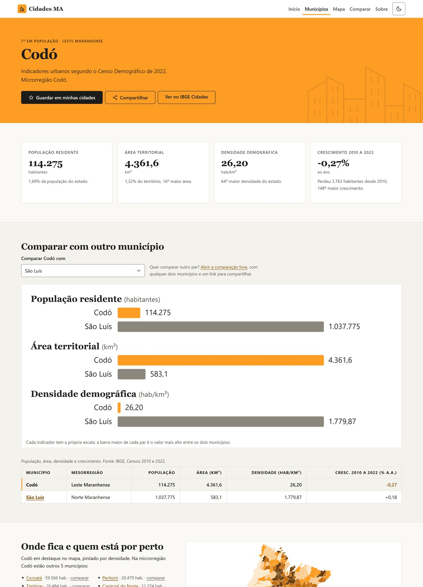
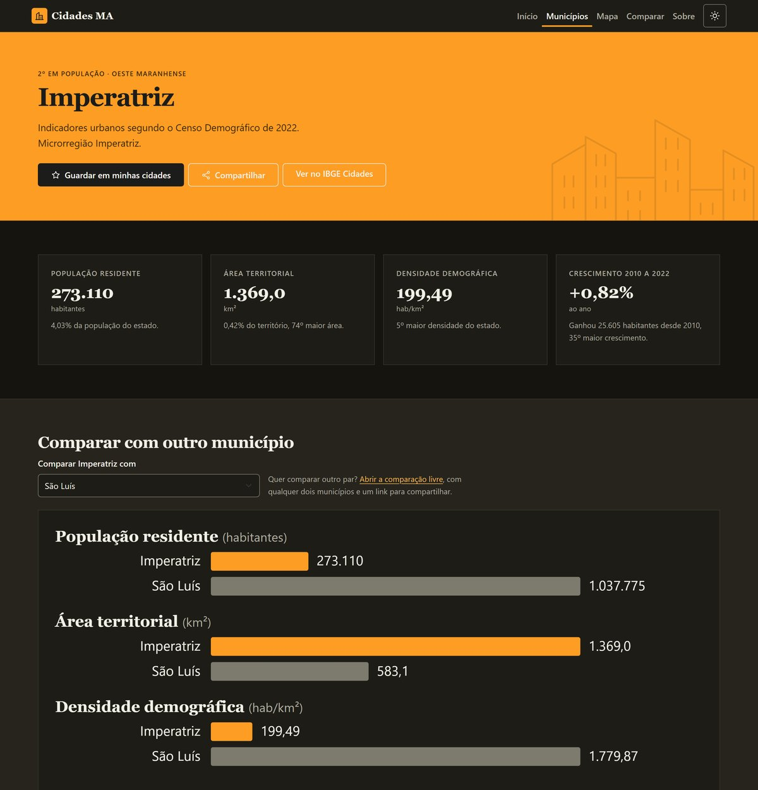
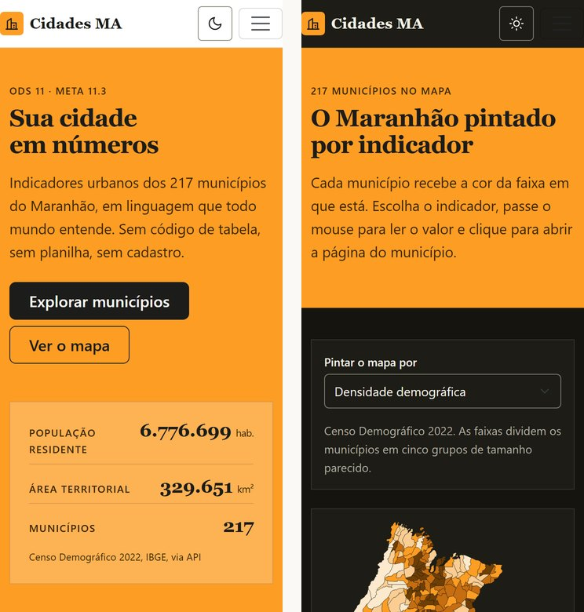

<p align="center">
  
</p>

<h1 align="center">Cidades MA</h1>

<p align="center">
  Os 217 municípios do Maranhão em população, área e densidade, em linguagem que dispensa código de tabela.<br>
  Dados do Censo Demográfico 2022, consumidos ao vivo da API pública do IBGE.
</p>

<p align="center">
  <a href="https://cidades-ma.netlify.app/"><strong>Abrir a aplicação</strong></a> ·
  <a href="#como-rodar">Como rodar</a> ·
  <a href="#como-os-dados-chegam">Como os dados chegam</a> ·
  <a href="#estrutura">Estrutura</a>
</p>

<p align="center">
  
  
  
  
  
  
</p>

---

## Por que existe

Os indicadores urbanos dos municípios maranhenses são públicos e existem. Mas ficam dispersos em portais técnicos do IBGE, organizados por código de tabela e feitos para pesquisadores. Quem precisa deles para decidir ou para cobrar, como vereadores, conselhos municipais, jornalistas, estudantes e moradores, não consegue consultar nem comparar de forma simples.

**Dado público que ninguém consegue ler não sustenta participação.** É a lacuna que a meta 11.3 do ODS 11 aponta: aumentar a capacidade para o planejamento participativo e integrado nas cidades. O Cidades MA pega o dado do IBGE, tira o código de tabela do caminho e entrega em uma tela que qualquer pessoa entende.

## O que ela faz

| | |
|---|---|
| **Mapa** | O Maranhão com os 217 municípios pintados por população, densidade, área ou crescimento, em cinco faixas. Passe o mouse para ler o valor, clique para abrir o município. SVG desenhado pela aplicação a partir da malha do IBGE. |
| **Busca e filtro** | Os 217 municípios em uma grade. Busca por nome sem se importar com acento, filtro por mesorregião e ordenação por população, área, densidade ou nome. Os filtros ficam na URL: o resultado é compartilhável por link e o botão voltar desfaz o último filtro. |
| **Indicadores** | População, área, densidade e crescimento 2010 a 2022 de cada município, com a posição dele no estado, os vizinhos da microrregião e o lugar dele no mapa. |
| **Comparação** | Na página de um município, escolha qualquer outro e veja os dois lado a lado. Na página Comparar, escolha os dois livremente, inverta a ordem e compartilhe o par pelo link. |
| **Minhas cidades** | Marque a estrela em qualquer município e ele fica guardado no navegador, com atalho para comparar os dois primeiros. |
| **Compartilhar** | No celular abre a folha nativa; no desktop copia o link. Toda comparação e todo município têm endereço próprio. |
| **Panorama** | Distribuição dos municípios por tamanho de população e por mesorregião, na página inicial. |
| **Tema claro e escuro** | Segue a preferência do sistema e aceita a escolha manual, lembrada no navegador. |
| **Dados ao vivo, com reserva** | A cada abertura, a aplicação consulta a API do IBGE. Se ela não responder em dez segundos, usa uma cópia dos mesmos dados gravada no pacote e avisa na tela. |

## Telas

<p align="center"></p>

<p align="center"></p>

<p align="center"></p>

<p align="center"></p>

<p align="center"></p>

<p align="center"></p>

## Como os dados chegam

Ao abrir, o navegador faz **três consultas em paralelo** à API pública do IBGE, com a Fetch API, e combina as respostas em JSON pelo código do município. O mapa carrega uma quarta, só quando aparece:

| Consulta | Endpoint | O que traz |
|---|---|---|
| Localidades (v1) | `/api/v1/localidades/estados/21/municipios` | Os 217 municípios do Maranhão, com micro e mesorregião |
| Agregados (v3), tabela 4714 | `/api/v3/agregados/4714/periodos/2022/variaveis/93\|6318\|614?localidades=N6[N3[21]]` | População residente (93), área territorial (6318) e densidade demográfica (614) do Censo 2022, para todo o estado em uma chamada |
| Agregados (v3), tabela 4709 | `/api/v3/agregados/4709/periodos/2022/variaveis/5936\|10605?localidades=N6[N3[21]]` | Variação absoluta da população desde 2010 (5936) e taxa de crescimento geométrico anual 2010 a 2022 (10605) |
| Malhas (v3) | `/api/v3/malhas/estados/21?formato=application/vnd.geo+json&intrarregiao=municipio&qualidade=minima` | Contorno dos 217 municípios em GeoJSON, projetado para SVG pela aplicação |

Nenhuma exige chave de acesso e todas respondem com CORS aberto. O parser que interpreta as respostas é uma função pura, coberta por testes. **Nenhum valor é estimado pela equipe.**

## Como rodar

```bash
git clone https://github.com/agenciadigitalslz/cidades-ma.git
cd cidades-ma
npm install
npm run dev
```

| Comando | O que faz |
|---|---|
| `npm run dev` | Servidor de desenvolvimento com recarga automática |
| `npm test` | Testes de unidade com Vitest (parser da API, filtros, ordenação, formatação) |
| `npm run lint` | Análise estática com oxlint |
| `npm run build` | Gera a pasta `dist/` pronta para publicar |
| `npm run preview` | Serve a pasta `dist/` localmente |
| `node scripts/capturas.mjs` | Captura as telas em desktop e celular, nos dois temas, a partir de `dist/` |
| `node scripts/imagem-social.mjs` | Regenera a imagem de prévia dos links (`public/og.jpg`) |

## Estrutura

```
cidades-ma/
├── index.html                      Documento único da aplicação, com os metadados sociais
├── public/
│   ├── _redirects                  Reescrita de rotas para o Netlify (SPA)
│   └── og.jpg                      Imagem de prévia para WhatsApp e redes
└── src/
    ├── main.jsx                    Ponto de entrada: Router e provedor de dados
    ├── App.jsx                     Rotas e esqueleto (cabeçalho, miolo, rodapé)
    ├── servicos/
    │   ├── ibge.js                 Fetch API: Localidades, SIDRA 4714 e 4709, parser puro
    │   ├── malha.js                API de malhas e projeção GeoJSON para SVG
    │   ├── municipios.js           Ordenar, filtrar, totais, ranking
    │   └── formatar.js             Números em pt-BR e normalização para busca
    ├── contexto/                   Dados do IBGE (carregando, ok ou reserva) e minhas cidades
    ├── hooks/                      useTema (claro e escuro) e useTitulo (título da aba)
    ├── componentes/                CabecalhoSite, BotaoTema, Destaque, PainelResumo,
    │                               BlocoExplicativo, CardMunicipio, CardIndicador,
    │                               TabelaComparativa, BarraBusca, GraficoBarras,
    │                               MapaMaranhao, Distribuicao, BotaoFavorito,
    │                               BotaoCompartilhar, CardEsqueleto, EstadoDados,
    │                               RodapeSite, Icones
    ├── paginas/                    Inicio, Municipios, Indicadores, Comparar, Mapa, Sobre, NaoEncontrada
    ├── estilos/                    base.css (tokens, tipografia) e componentes.css
    └── dados/                      Cópias locais do Censo 2022 e da malha, usadas só em reserva
```

Cada componente corresponde a um bloco que a primeira versão do projeto, em HTML estático, já marcava com o comentário `<!-- Componente: X -->`. A migração para React foi recorte, não reescrita.

## Rotas

| Rota | Página |
|---|---|
| `/` | Início: panorama do estado e os oito municípios mais populosos |
| `/municipios` | Grade com busca, filtro e ordenação (`?q=`, `?regiao=`, `?ordem=`, `?minhas=1`). A tecla `/` foca a busca de qualquer página |
| `/municipios/:id` | Indicadores do município, comparação com outro, vizinhos e mapa |
| `/mapa` | O estado pintado por indicador (`?indicador=populacao`, `densidade`, `area` ou `crescimento`) |
| `/comparar` | Comparação livre entre dois municípios quaisquer (`?a=` e `?b=`), compartilhável por link |
| `/sobre` | Problema, ODS, público-alvo, fontes e equipe |

## Tecnologias e decisões

| Requisito | Como foi atendido |
|---|---|
| JavaScript ES6+, DOM e eventos | Módulos ES, `async/await`, eventos de formulário, teclado (Escape fecha o menu) e clique tratados em React |
| Fetch API e JSON | `src/servicos/ibge.js`, duas chamadas em paralelo, tempo limite e tratamento de erro |
| Componentes | 13 componentes de função, um por bloco visual |
| Gerenciamento de estado | `useState`, `useReducer` e dois Contexts (dados do IBGE e minhas cidades, esta persistida no navegador); filtros na URL com `useSearchParams` |
| Navegação e SPA | React Router 7, rota com parâmetro e rota 404; o documento nunca recarrega |
| Responsividade | Bootstrap 5 e CSS próprio, verificados de 360 a 1440 pixels |
| Acessibilidade | Contraste medido nos dois temas, foco visível, link para pular ao conteúdo, rótulo em todo campo, alvos de toque de 44 px, resultado da busca anunciado por `aria-live` |
| Mapa e gráficos | SVG desenhados pela própria aplicação, sem biblioteca: malha do IBGE projetada em JavaScript e pintada por quintis; barras com as cores do tema |
| Testes | 25 testes de unidade sobre as funções puras: parsers da API, projeção da malha, filtros, ordenação, quantis, distribuição e formatação |
| Publicação | Vite gera `dist/`; Netlify serve com reescrita de rotas |

## Identidade visual

A cor de destaque é o `#fd9d24`, laranja oficial do ODS 11 definido pela ONU, usado no máximo duas vezes por tela. Títulos em serifa, corpo em sem-serifa, ícones em SVG de traço único. Os neutros são quentes nos dois temas, sem preto e branco puros.

## Equipe

Curso Superior de Tecnologia em Análise e Desenvolvimento de Sistemas, UEMA / UEMAnet. Disciplina de Desenvolvimento Web.

- André da Silva Lopes
- Andressa de Jesus Nunes de Souza
- Pedro Aurélio Cutrim da Rocha Lima

## Fontes e licenças

- Dados: IBGE, Censo Demográfico 2022, tabela 4714 do SIDRA e API de Localidades. Uso público.
- Bootstrap sob licença MIT. React, Vite e React Router sob licença MIT.
- Ícones e ilustrações desenhados pela equipe em SVG.
